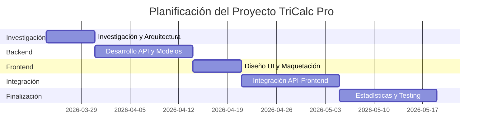
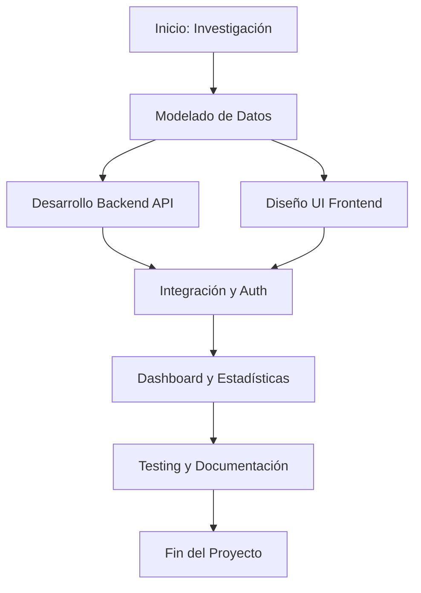

# Documentación del Proyecto: Contador Ritmo (TriCalc Pro)

Esta documentación detalla los aspectos fundamentales del desarrollo, planificación y ejecución del proyecto.

## 1. Descripción del Proyecto y Ámbito de Implantación

### ¿Qué has desarrollado y por qué?
He desarrollado **TriCalc Pro (Contador Ritmo)**, una plataforma integral diseñada específicamente para triatletas. La aplicación permite centralizar la planificación, el registro y el análisis de sesiones de natación, ciclismo y carrera a pie en una sola interfaz moderna y eficiente.

La motivación principal surge de la necesidad de los deportistas multi-deporte de tener un control exhaustivo no solo de sus ritmos y distancias, sino también del ciclo de vida de su equipamiento (zapatillas, bicicletas, componentes) y de sus objetivos competitivos en un entorno visualmente atractivo que fomente la motivación.

### ¿Quién lo usará?
El público objetivo son **triatletas** de todos los niveles (desde principiantes hasta élite) que buscan una alternativa personalizada a las grandes plataformas comerciales, con un enfoque más centrado en la simplicidad, la estética "glassmorphism" y la gestión específica de planes de entrenamiento y competiciones.

### ¿Qué tecnologías has usado?
El proyecto se ha construido sobre un stack tecnológico robusto y moderno:
- **Backend:** Django y Django Rest Framework (DRF) para una API escalable y segura, con autenticación basada en JWT (JSON Web Tokens).
- **Frontend:** React 19 (Vite) para una interfaz de usuario reactiva y ultrarrápida.
- **Estilo:** CSS Vanilla con un sistema de diseño propio basado en variables CSS y efectos de cristalinidad (glassmorphism).
- **Visualización:** Recharts para gráficas de rendimiento y Lucide React para la iconografía.
- **Base de Datos:** SQLite para desarrollo (migrable a PostgreSQL para producción).

### ¿Se prevén cambios en el futuro?
Sí, el proyecto está diseñado para evolucionar:
- **Sincronización Automática:** Integración total con las APIs de Suunto, Garmin y Strava.
- **Análisis Avanzado:** Implementación de algoritmos para calcular la carga de entrenamiento (TSS) y fatiga.
- **Versión Móvil:** Transformación en una PWA (Progressive Web App) o desarrollo de una app nativa con React Native.
- **Comunidad:** Funcionalidades sociales para compartir rutas y retos.

---

## 2. Temporalización del Proyecto y Fases del Desarrollo

### Planificación y Descripción de Fases
El proyecto se dividió en 5 fases principales, ejecutadas a lo largo de un ciclo de 8 semanas.

| Fase | Actividad | Duración |
| :--- | :--- | :--- |
| **Fase 1** | Investigación, modelado de datos y arquitectura (Hybrid Activity Model). | 1 semana |
| **Fase 2** | Desarrollo del Backend: API, Auth JWT, Modelos de Gear y Actividades. | 2 semanas |
| **Fase 3** | Desarrollo del Frontend: Configuración, Sistema de Diseño y Layout. | 1 semana |
| **Fase 4** | Integración: Conexión API-Frontend, Diario de entrenamiento y Auth Pages. | 2 semanas |
| **Fase 5** | Pulido, visualización de estadísticas, testing y documentación final. | 2 semanas |

### Diagrama de Gantt (Secuencia Temporal)

### Diagrama de PERT (Secuencia de Actividades)

### Retos y Aprendizajes Significativos

- **El "Hybrid Activity Model":** Uno de los mayores retos fue diseñar un modelo de base de datos único que fuera capaz de almacenar datos tan dispares como las brazadas en natación y los vatios en ciclismo. La solución fue usar un `JSONField` extensible en Django, lo que me enseñó la importancia de la flexibilidad en el diseño de esquemas.
- **Glassmorphism con CSS Puro:** Conseguir un diseño premium sin depender de librerías externas de UI supuso un desafío técnico. Aprendí a manejar profundamente las propiedades de `backdrop-filter`, `rgba` y sombras complejas para lograr profundidad visual.
- **Gestión de Sesiones con JWT:** Implementar un flujo seguro de tokens (access y refresh) en React fue más complejo de lo previsto. Esto reforzó mi comprensión sobre la seguridad en aplicaciones web modernas y el ciclo de vida de los componentes de React ante estados de carga.
- **Aprendizaje:** El proyecto me ha permitido consolidar la visión "full-stack", entendiendo cómo una decisión en el backend (ej: estructura de respuesta) impacta directamente en la experiencia del usuario final.
